  

 

  

  

    Studying <b>Electronics & Electrical Communication Engineering</b> at IIT Kharagpur. I build high-performance systems that span from sub-microsecond matching engines and compiler pipelines to multi-agent AI platforms and DeFi infrastructure. <b>Codeforces Expert (1620)</b>.
  

  
  

    <a href="https://linkedin.com/in/kartik-patil-957834201">
      <picture>
        <source media="(prefers-color-scheme: dark)" srcset="https://img.shields.io/badge/LinkedIn-0d1117?style=flat-square&logo=linkedin&logoColor=ffffff"/>
        
      </picture>
    </a>
    <a href="mailto:kmzpatil@gmail.com">
      <picture>
        <source media="(prefers-color-scheme: dark)" srcset="https://img.shields.io/badge/Email-0d1117?style=flat-square&logo=gmail&logoColor=ffffff"/>
        
      </picture>
    </a>
    <a href="https://codeforces.com/profile/kresol">
      <picture>
        <source media="(prefers-color-scheme: dark)" srcset="https://img.shields.io/badge/Codeforces_Expert-0d1117?style=flat-square&logo=codeforces&logoColor=ffffff"/>
        
      </picture>
    </a>
  

---

  

  

---

  

<table>
  <tr>
    <td width="50%">
      <h3>Frammer - Unified AI Analytics Platform</h3>
      
<i>General Championship | Rank 1 Gold Medal</i>

      
Full-stack analytics platform with an autonomous ATLAS AI engine using a custom ReAct loop for data analysis. Developed a custom DSL parser to track 19+ complex KPIs, implementing a secure PostgreSQL multi-tenant RBAC architecture supporting strict tenant isolation. Integrated Docker, Google Gemini, and Chronos forecasting. Cut data retrieval delays by <b>35%</b> on 1M+ row operations using partial and covering B-tree indexes.

      
<code>FastAPI</code> <code>React</code> <code>Vite</code> <code>PostgreSQL</code> <code>Docker</code> <code>Gemini</code>

    </td>
    <td width="50%">
      <h3>Multithreaded Order Book Matching Engine</h3>
      
<i>Low-Latency C++ Systems</i>

      
Matching engine processing concurrent orders via thread-safe mutex-protected single-consumer queue handling <b>10,000+ msgs/sec</b>. Concurrent state management using condition variable for blocking pops and an atomic engine flag for <b>zero-leak</b> teardowns. Price-time priority order matching using <code>std::map</code> with <code>std::greater</code>. Optimized critical paths for sub-microsecond processing, reducing p99 latency by <b>40%</b>.

      
<code>C++</code> <code>Multithreading</code> <code>CMake</code> <code>Google Benchmarks</code>

    </td>
  </tr>
  <tr>
    <td width="50%">
      <h3>Mini-Compiler</h3>
      
<i>Compiler Design from Scratch</i>

      
Assembled C++ compiler pipeline translating source code into bytecode for a stack-based virtual machine, compiling <b>10K+ lines/sec</b>. Constructed recursive descent Lexer and Parser from scratch to tokenize <b>5 core keywords</b> and execute syntax checking. Implemented comprehensive support for <b>18+ operators</b> in AST visitors. Built stack-based VM optimizing memory management for <b>50%+</b> quicker runs.

      
<code>C++</code> <code>CMake</code>

    </td>
    <td width="50%">
      <h3>Real-Time Autocomplete Engine</h3>
      
<i>High-Performance Data Structures</i>

      
C++ top-k suggestion system providing predictive completions for <b>1.2M+ entries</b>. Memory-efficient Radix Tries with per-node top-K caching indexing <b>500,000+ word</b> vocabularies. Interactive terminal interface capturing dynamic keystrokes to benchmark latency. Optimized string matching for <b>10K+ QPS</b> throughput, achieving sub-millisecond lookup for <b>10M+</b> queries.

      
<code>C++</code> <code>CMake</code>

    </td>
  </tr>
  <tr>
    <td width="50%">
      <h3>DeFi Arbitrage Bot</h3>
      
<i>Decentralized Finance</i>

      
Python DeFi arbitrage engine using <b>Web3.py</b> and <b>Infura</b> monitoring <b>50+ Uniswap V3 pools</b> for price discrepancies. Implemented <b>Bellman-Ford</b> negative cycle detection on <b>100+ node token graphs</b> to identify triangular arbitrage paths. Formulated profit calculations with real-time <b>gas oracles</b> for <b>95%+</b> accurate net PnL. Deployed FastAPI dashboard with WebSocket feeds.

      
<code>Python</code> <code>Web3.py</code> <code>FastAPI</code> <code>WebSocket</code>

    </td>
    <td width="50%">
      <h3>Gloser AI - Pharma Intelligence</h3>
      
<i>Multi-Agent LLM System</i>

      
AI-powered intelligence systems using <b>LangGraph</b> multi-agent architectures to profile <b>5,000+</b> clinical and trade queries. Specialized Python agents integrated with <b>Groq API</b> to process <b>30,000+</b> pharmaceutical records. Designed <b>Next.js</b> chat interfaces and <b>Flask APIs</b> enabling backend communication with live LLMs under <b>500ms</b> latency. Strict TypeScript definitions reducing runtime errors by <b>40%</b>.

      
<code>Next.js</code> <code>LangGraph</code> <code>Groq</code> <code>Flask</code> <code>Python</code>

    </td>
  </tr>
  <tr>
    <td width="50%">
      <h3>CDC Companion - CV Review Platform</h3>
      
<i>Full-Stack SaaS</i>

      
High-performance REST API matching <b>500+</b> candidates with reviewers. AI review agent extracting text from <b>1,000+ PDFs</b> to generate domain-specific CV feedback via LLMs. JWT auth, dependency-free rate limiter, and automated Nodemailer with <b>&lt;2s</b> delivery latency.

      
<code>Node.js</code> <code>TypeScript</code> <code>Prisma</code> <code>LLMs</code>

    </td>
    <td width="50%">
      <h3>Chernobyl Prevention System</h3>
      
<i>Deep Learning for Risk Classification</i>

      
Deep sequence classification model utilizing LSTM to predict <b>4 risk levels</b> from 27-dimensional continuous sensor data. Engineered rolling volatility and interquartile ranges, applying cubic transforms to amplify extreme datasets. Dynamic training strategy using decreasing batch sizes. Optimized hyperparameters using Optuna, boosting F1-score to <b>0.94</b> and reducing training epochs by <b>30%</b>.

      
<code>Python</code> <code>PyTorch</code> <code>Optuna</code> <code>LSTM</code>

    </td>
  </tr>
  <tr>
    <td width="50%">
      <h3>Cancer Detection System</h3>
      
<i>1st Runner-up at KDAG ML Hackathon</i>

      
Engineered pipeline resolving circular dependencies via HDBSCAN outlier detection and KNN imputation, achieving <b>92%+ precision</b>. Architected ensemble of 10 EfficientNet and ResNet using majority-class batching. Optimized Gradient Boosting hyperparameters utilizing Optuna, maximizing F1-scores by <b>15%</b>. Accelerated processing pipeline speed by <b>35%</b> utilizing multi-threaded data loading and vectorized pandas operations.

      
<code>Python</code> <code>PyTorch</code> <code>Optuna</code> <code>Scikit-Learn</code>

    </td>
    <td width="50%">
      <h3>GMUN 2026 - Event Platform</h3>
      
<i>Official IIT KGP MUN Platform</i>

      
Digital interface for the Global Model United Nations at IIT KGP handling <b>300+</b> delegate registrations. Mobile-first responsive design with seamless registration workflows.

      
<code>React.js</code> <code>Node.js</code> <code>CSS3</code>

    </td>
  </tr>
</table>

---

  

| Competition | Result |
| :--- | :--- |
| **IICPC CodeFest 2026 Global** | Rank 1254 / 13,000+ coders |
| **IMC Prosperity 4** | Global Rank 529, Country Rank 81 |
| **Goldman Sachs India Hackathon 2026** | Quant: Rank 447, CS: Rank 584 |
| **AMS Derive 2026** (Jane Street, QRT) | Rank 198 / 2,500 |

---

  

### Web & Full Stack
- **[Cdc-Companion](https://github.com/kmzpatil/Cdc-Companion)** - TypeScript
- **[Agentic-Dashboard](https://github.com/kmzpatil/Agentic-Dashboard)** - JavaScript
- **[sophomore-contact-form](https://github.com/kmzpatil/sophomore-contact-form)** - TypeScript
- **[sophomore-contact-form-frontend](https://github.com/kmzpatil/sophomore-contact-form-frontend)** - TypeScript
- **[Todo_Frontend](https://github.com/kmzpatil/Todo_Frontend)** - TypeScript
- **[Todo_Backend](https://github.com/kmzpatil/Todo_Backend)** - JavaScript
- **[nodejs_backend](https://github.com/kmzpatil/nodejs_backend)** - JavaScript
- **[WEbsite-designer](https://github.com/kmzpatil/WEbsite-designer)** - TypeScript
- **[Contest-tracker](https://github.com/kmzpatil/Contest-tracker)** - TypeScript
- **[Prosperity](https://github.com/kmzpatil/Prosperity)** - HTML
- **[techteam1](https://github.com/kmzpatil/techteam1)** - HTML

### AI, Data & Quant
- **[KGPharmAgents](https://github.com/kmzpatil/KGPharmAgents)** - Python
- **[DeFi-Arbitrage-Bot](https://github.com/kmzpatil/DeFi-Arbitrage-Bot)** - Python
- **[Cancer-Analysis](https://github.com/kmzpatil/Cancer-Analysis)** - Jupyter Notebook
- **[Manpower_optimisation_in_Manufacturing_using_Multi-Objective_Optimization](https://github.com/kmzpatil/Manpower_optimisation_in_Manufacturing_using_Multi-Objective_Optimization)** - Jupyter Notebook
- **[Kdag_Task](https://github.com/kmzpatil/Kdag_Task)** - Jupyter Notebook
- **[Summer_Analytics_Hackathon](https://github.com/kmzpatil/Summer_Analytics_Hackathon)** - Jupyter Notebook
- **[SA_W1_Assignment](https://github.com/kmzpatil/SA_W1_Assignment)** - Jupyter Notebook

### Core Systems (C++)
- **[AutoComplete-Engine](https://github.com/kmzpatil/AutoComplete-Engine)** - C++
- **[Mini-Compilor](https://github.com/kmzpatil/Mini-Compilor)** - C++

---

  

  

 

  <!-- Contribution Telemetry Graph -->
  <picture>
    <source media="(prefers-color-scheme: dark)" srcset="https://github-readme-activity-graph.vercel.app/graph?username=kmzpatil&bg_color=00000000&color=ffffff&line=ffffff&point=ffffff&area_color=ffffff&area=true&hide_border=true&radius=0&custom_title=CONTRIBUTION%20TELEMETRY"/>
    
  </picture>

 

  <!-- GitHub Activity Timeline Chart -->
  

 

  <!-- Replaced the broken official vercel app with the stable community instance -->
  
  

 

  

 

  

